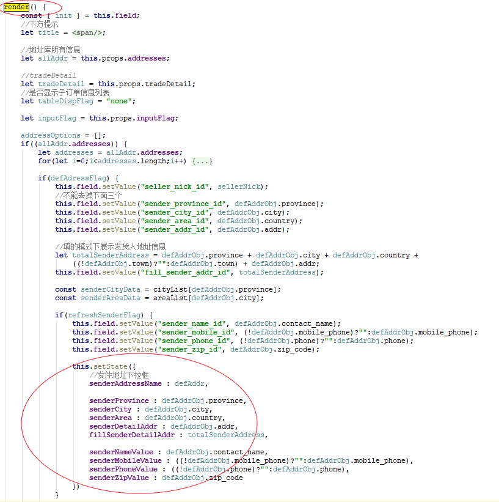
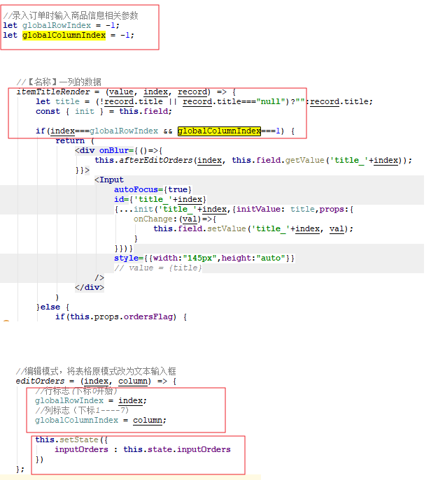
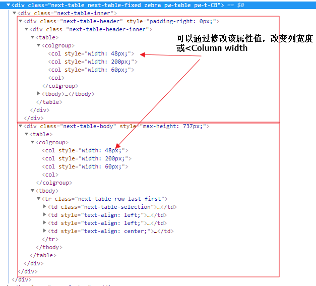

# 前端总结

最近店管家新版功能与普云交易重叠，参考普云交易部分代码，发现一些不规范的内容；结合辅导吴国栋过程中发现的问题，总结一下前端核心要点分享。

希望大家的代码都在符合规范的情况下，基于思路清晰，简单的原则设计。

另：通常最复杂的地方在render方法，建议将render()根据页面结构，分拆成不同的部分，方便自己与他人理清思路。如

``` 
renderHeader(){...}
renderLeft(){...}
renderRight(){...}

render(){
    return <div class="page">
        {this.renderHeader()}
        {
            [
                this.renderLeft(),
                this.renderRight()
            ]
        }
    </div>
}
```

## React，js相关

### 0.React核心：状态与生命周期

状态只能在生命周期方法中更新，而绝对不能直接在render()方法中更新。render()只负责根据状态渲染。

不规范的用法：render()中直接更新state


### 1.与页面渲染相关的变量，都应该放在state中。

下面不规范的代码，globalRowIndex控制表格column是编辑状态还是普通状态，但是没有放在state。
这就导致了核心点2.
不规范示例：


### 2.修改状态只能用setState！！！

绝对不要使用 `this.state.xxx=newValue; `

#### 2.1 setState的作用

通过setState，状态会更改并自动执行render()方法。
在第一节示例中，因为变量的不规范使用，额外执行了一遍 `this.setState({inputOrders : this.state.inputOrders})`,原本是毫无意义的代码。 作用仅仅是触发页面render，使之前的未在状态中控制的变量赋值生效。

### 3.setState是异步方法

所以setState后如果立即获取state中的内容，可能是旧的内容，导致出现页面总是比逻辑慢一步的情况。
正确的做法是

```
this.setState(
{
    name:value
},nextFunction)
或
this.setState(
{
    name:value
},()=>{
    nextFunction()
})
```

### 4.受控组件与非受控组件，以及Field组件 

三种选择一种方式，但不要一个组件混杂2种方式

1.受控组件,有value属性以及onChange方法。
value完全控制组件显示内容，
用户输入时，触发onChange修改value的值，然后页面更新显示用户输入的内容

```
<Input
    onChange={ this.onMemoChange.bind(this) }
    placeholder="请输入标记（不超过500字）"
    value={ this.state.memo }
/>
```
2.非受控组件，用户输入时实时更新显示，但是在用时需要取值 `this.refs.a.state.value`

```
<Input
    ref="a"
/>
```

3.qnui Field组件。

```
class Demo extends React.Component {
    field = new Field(this,{
        onChange:(name, value) {
          switch(name) {
            case 'name1':
              this.field.setValue('name2','value set by name1');
              break;
            case 'name2':
              this.field.setValue('name1','value set by name2');
              break;
          }
        }
    });
    render() {
        const init = this.field.init;

        return <div>
          <Input {...init('name1')} />
          <Input {...init('name2')} />
        </div>
    }
}

```
混杂示例

```$xslt
case 'input_trade_tid_id':
    this.field.setValue("input_trade_tid_id", value);
    this.setState({
        tid : value
    });
    break;
             
<Select
    {...init('sender_address_id',{initValue: defAddr})}
    style={{verticalAlign: "middle",width:"708px"}}
    autoWidth={true}
    // defaultValue={defAddr}
    value={this.state.senderAddressName}
>
    { addressOptions }
</Select>
```

可以使用this.field.setValue(name,value),赋值，但是不能有value属性，
也可以通过<Input value={this.state.name} 控制，这种带value的，就是"受控组件",值完全由value控制。受控组件一般是有个onchange,里面通过setState修改组件值。
都可以使用，但是不要一起使用
### 5.ref引用

``` 
<input ref="name"/>
取值：this.refs.name.value
赋值：this.refs.name.value='newValue'
```
原始input与qnui Input组件的不同：

``` 
<Input ref="qninput"/>
取值：this.refs.qninput.state.value
赋值：this.refs.qninput.setState({value:'newValue'})

```


## 样式
系统中所有样式，都会打包到一个样式文件中。所以任何一个scss样式文件中的顶级样式，会作用于所有页面。
所以规范是：确定通用的样式放在styles/commons.scss或styles/theme.scss中，其他自己负责的专用组件样式文件定义一个独特的顶级className，所有样式放在该顶级className之下。
也不要引用样式文件，最初不了解可能存在引用其他样式文件的情况，这是不需要的。

```
如：containers/trade/index.scss
.tradeIndex{
    .a{}
    .b{}
    .c{}

}
而不要出现
.tradeIndex{

}
.a{}
.b{}
```
### 1.qnui Table 样式控制



